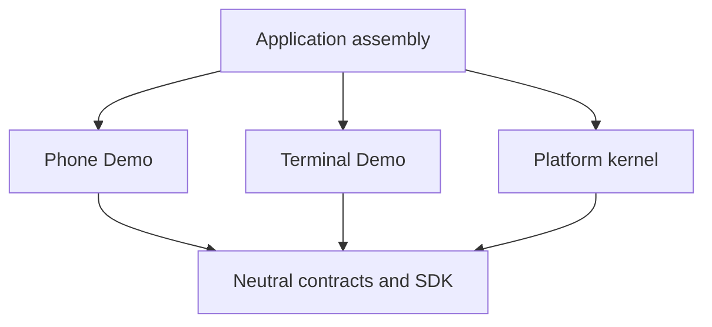

# M0 architecture review

Status: consolidated from the design interview for review. This document authorizes no implementation or external publication. [Scope](m0-scope.md) defines the two gameplay slices; [acceptance criteria](m0-acceptance.md) define the evidence required. [Glossary](../../GLOSSARY.md) supplies shared terminology, and ADR-0001 through ADR-0009 record decision rationale.

## Architectural thesis

The platform provides capabilities. Cases provide gameplay.

A case is its own interactive investigation application. Phone Demo and Terminal Demo intentionally differ in presentation, navigation, action types, state, transitions, projections, protected-content decisions, and completion conditions. Their coexistence must not introduce either case's mechanics into the platform kernel.

## Dependency boundary

Arrows indicate code dependencies. Runtime dispatch invokes registered case implementations through neutral contracts.

| Layer | Responsibilities | Boundary |
| --- | --- | --- |
| Kernel/contracts | Guest access, registry resolution, playthrough lifecycle, persistence, revision/idempotency, dispatch, asset delivery, basic operational records | No case-package imports, case-ID branches, or case-specific gameplay semantics |
| Cases | Frontend, navigation, visuals, action validation, state schemas/transitions, player projection, protected-content decisions, completion conditions | Depend on neutral contracts; private state is never automatically exposed |
| Application assembly | Import and register frontend/backend case implementations; wire neutral infrastructure | This is the permitted place for explicit knowledge of the two demos |

Adding Terminal Demo changes its own packages and application registration. It must not require Phone-shaped or Terminal-shaped gameplay contracts in the kernel. Do not extract generic phone, terminal, filesystem, or investigation engines for M0.

## Repository structure and parallel work

| Location | Responsibility |
| --- | --- |
| `app/` | Vite/React/TypeScript application |
| `app/src/platform` | Neutral frontend platform and thin SDK |
| `app/src/cases` | Case-owned frontend implementations |
| `app/src/assembly` | Frontend case imports and registration |
| `server/` | Go backend |
| `server/internal/kernel` | Neutral backend kernel and infrastructure |
| `server/internal/cases` | Case-owned backend implementations |
| `server/internal/assembly` | Backend case imports and registration |
| `contracts/` | Language-neutral app-to-server protocol and representative examples |
| `migrations/` | PostgreSQL schema migrations |
| `docs/` | Glossary-related guidance, architecture, acceptance, ADRs, and specification |

These are repository locations, not speculative shared runtime packages. Each side enforces its own three-layer dependency boundary. Frontend platform code never imports frontend case implementations; backend kernel code never imports backend case implementations. Composition roots on their respective sides register cases.

Establish the minimal neutral wire contract before branching frontend/backend implementation work. Each side implements its own language-specific envelope types against that agreement; neither side depends on compiling or importing the other's runtime. Frontend development may use lightweight local responses matching the contract; final acceptance uses the real backend and PostgreSQL. Each demo's action/payload/view agreement remains case-owned and can be coordinated separately without extending the neutral transport schema. No generated SDK, contract service, or shared gameplay package is required.

## Execution and deployment

Cases are trusted first-party application code. One Vite application shares a browser document, and explicitly registered Go packages share one backend process. Independent deployment and hostile-code sandboxing are deferred. Accidental frontend interference and shared-process failures are accepted engineering risks rather than promised isolation boundaries.

The local milestone runs the web app, Go API, and PostgreSQL behind one browser origin. It requires reproducible clone-to-run instructions, not production hosting. A hosted demonstration is a later milestone.

React + TypeScript + Vite, Go, and PostgreSQL match the agreed runtime/persistence direction. Bun and a monorepo remain the working tooling direction. Top-level layout and layer locations are fixed above; exact tool versions, subordinate package details, ports, and local routing/proxy setup remain implementation choices.

## Frontend ownership and SDK

The platform owns the launcher, case selection/loading, playthrough identity, SDK construction, and mount/unmount lifecycle. Each case receives a dedicated root and owns the gameplay viewport. It may choose its routing, styling, and local state approach. Scoped styling is preferred where practical; case-created effects must be cleaned up when leaving.

The platform owns the playthrough URL prefix, such as `/play/:playthroughId/*`; the case receives the suffix. Every internal view need not be bookmarkable. Resolving a route does not authorize protected content.

The SDK provides only neutral operations exercised by these demos: obtaining the player-visible view, submitting case-owned actions, and accessing authorized assets in the current playthrough. Opaque views, payloads, and outcomes retain case-owned types and meanings. The SDK imposes no shared gameplay components, navigation, global gameplay store, or phone/terminal primitives. A thin transport adapter is the smallest implementation assumption; precise method signatures remain specification details.

## Playthrough ownership and persistence

An anonymous guest owns server-backed playthroughs. A persistent opaque cookie identifies the guest; a playthrough ID or URL grants no access by itself. Same-browser/profile resume survives reload, browser restart, and returning later. Recovery after clearing storage, accounts, and cross-device access are deferred.

The platform persists a generic envelope containing identity, case/compatibility-version pin, revision, and lifecycle metadata, plus an opaque case-owned JSONB document. Cases own initialization, validation, transitions, and explicit player-visible projection. Authority, persistence, and secrecy are independent properties. Harmless cosmetic state may remain entirely client-side.

Restart creates a new playthrough without overwriting the old one. Multiple runs per guest/case are valid even though the initial launcher needs only Continue and Restart. Automatic expiry/cleanup, history UI, and save-slot tooling are deferred.

## Authoritative actions and atomic commits

Protected gameplay submits attempts or actions, not client-authorized success flags. The platform authenticates the guest, checks playthrough access, resolves the pinned module, coordinates revision checks and committed-request lookup, and invokes case logic without interpreting its meaning.

M0 case handlers perform bounded synchronous computation over supplied state and server-only definitions. They return proposed state, outcome, events, and any case-declared completion signal. They receive no raw database access and perform no external HTTP calls, filesystem writes, jobs, queues, or asynchronous side effects.

Use an ordinary PostgreSQL transaction to coordinate the durable transition and its outcome. Concurrent writes cannot both overwrite the same base revision. Committed-request lookup must precede rejecting an otherwise identical committed retry as stale, and duplicate concurrent submissions cannot commit twice. These are behaviors to ensure, not a requirement for a generic transactional framework.

Each mutating request identifies its request ID, playthrough, base revision, case-owned action type, and payload. A durable authoritative change atomically records resulting state, first completion if any, revision, committed outcome, relevant events, and request/input identity.

The revision covers authoritative playthrough state as a whole. One transition advances it once, including when case state and first completion both change. Logging alone or an action with no durable change does not force advancement. A wrong password may advance revision if that case persists an attempt counter.

An identical retry of a committed request returns its recorded outcome without repeating the transition. Different input under an already committed request ID is rejected. Malformed, unauthorized, stale, and ordinary pre-commit failures need no durable request records; corrected attempts use a new ID. No-op responses do not require the committed-mutation receipt machinery.

Replayed outcomes carry their committed revision. The frontend preserves newer known state rather than replacing it with an older view and fetches current state when reconciliation requires it. Stale writes never silently overwrite newer progress. Ordinary operational records are observational; they do not reconstruct state or require an event bus.

## Completion

The case determines when the playthrough completes. The platform records first completion as monotonic metadata and can display it. It does not impose a generic prohibition on later actions. Cases control post-completion behavior. Completion is part of the same action commit, not a separate subsystem.

## Private state and protected assets

Unrevealed secret material remains in server-only definitions, case state, or protected assets. The browser receives only explicit case-produced projections and authorized content. Initial bundles, public assets, API views, and public registries must not contain unrevealed protected material. Intended public clues remain available for the player to infer solutions.

Public assets are safe for unauthenticated delivery. Protected fetches require guest access to the playthrough, its pinned case/version, and a case-owned asset authorization decision. The application server delivers the bytes; storage paths or copied URLs are not authorization. A fake Terminal Demo file remains a case concept; the platform only handles neutral protected content.

The simplest delivery assumption uses no-store for protected responses and excludes protected API/assets from service-worker caches. Protect inventories and server storage locations from accidental public exposure. Operational logs should not record raw secret-bearing inputs or private state by default. This is ordinary delivery hygiene, not a DRM or secret-management subsystem.

Clients are hostile; authors are trusted. Simple same-origin mutation protection uses non-GET JSON endpoints, SameSite cookies, and Origin validation. Deployed HTTPS cookies use HttpOnly and Secure; local development configuration must remain usable. Basic request limits and normal defensive handling suffice for M0. Sophisticated anti-automation, rotating CSRF-token infrastructure, and prevention of manually shared solutions are deferred.

## Compatibility versions and availability

A playthrough's case ID/version pin never changes in place. Version denotes compatibility of authoritative interpretation and state, not a hash of every artifact. Incompatible state, actions, passwords/solutions, server rules, or protected progression require a new version. Compatible editorial and cosmetic changes may retain the version.

Frontend/backend registrations must agree on case ID/version and fail obviously mismatched assembly. Developer discipline handles missed compatibility bumps; artifact hashing and content-addressed releases are outside M0.

A missing implementation makes its pinned playthrough unavailable without deleting state or permanently altering lifecycle. Restoring the implementation can restore availability. Development may require an explicit new run rather than retaining every old implementation. Before the first public case, separately settle historical-version retention, migration, or expiration guarantees.

## Deferred and implementation latitude

Only capabilities used by the two agreed slices are in scope. Hosting, offline play, accounts, multiplayer/realtime, AI, payments/entitlements, product analytics, reusable gameplay engines, custom case SQL, independent services, runtime plugins, and third-party authoring remain outside M0.

No expensive architectural dilemma remains unresolved for this milestone. Exact callback shapes, JSON serialization, schema details, demo command vocabulary, styling, tooling versions, and local startup commands should use the smallest implementation consistent with these boundaries. PWA installability is separate from the browser-based architectural proof and does not imply offline support.

The [M0 implementation specification](../specs/m0-platform-boundary.md) consolidates these decisions and acceptance criteria and is published as [GitHub issue #1](https://github.com/alireza-constantin/case-platform/issues/1). Its work sequence establishes the neutral contract before parallel frontend/backend implementation. Publication does not start implementation.
